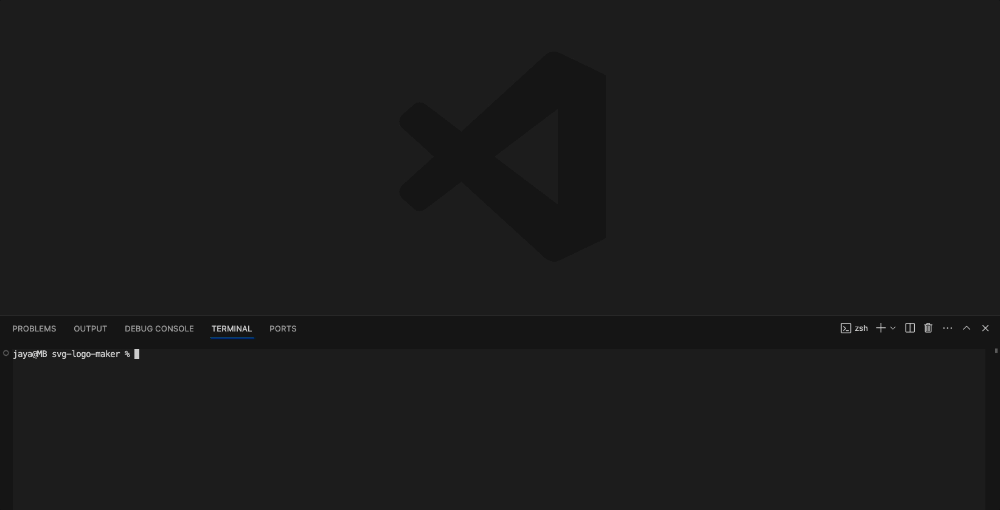

  <br>
  <h1 align="center">SVG Logo Generator</h1>

  ## Description
  This Node.js command-line application takes user input in order to generate a logo, which is then saved as an SVG file. 
  <br>

  
  
  This project is centered around Object-Oriented Programming and further familiarisation with node.js and the dependencies Inquirer and Jest.
  <br>

  Inquirer is utilised to prompt the user within the command line on their logo specification: a triangle, circle or square logo, 3 characters of text and the background/text color. On completion the console will log the message "Generated logo.svg". The SVG logo is written through the inbuilt 'fs write file' method that is required in node and saved into the "examples" folder.
  
  Jest is a JavaScript testing framework. For each shape we were generating, a corresponding test was required. We had to apply the concept of test-driven development, which is a coding practice that essentially means, test first, code later. Thus, we had to pre-specify what result we were looking to output and (hopefully) the code will past the test and function the way it was envisioned. I personally found the testing aspect very tricky, especially getting my head around having to write a test with no code (??!!) but got there in the end and I can definitely see the advantages of Jest, however if you were to test every piece of code prior to writing it, it would be a very long and expensive journey.

  As per usual, it was a big run around of trial and error only to come back to clean and simplistic looking code haha best way to learn though.
  
  
 

  ## Table of Contents
  - [Installation](#installation)
  - [User Story](#user-story)
  - [Acceptance Criteria](#acceptance-criteria)
  - [Example](#example)
  - [Usage](#usage)
  - [License](#license)
  - [Contributing](#contributing)
  - [Tests](#tests)
  - [Questions](#questions)

  ## Installation
  `node index.js`: to invoke the application
  <br>
  `npm init -y`: create a package.json file
  <br>
  `npm install`: install dependencies

  ### Dependencies
  `npm i jest`: running unit tests
  <br>
  `npm i inquirer@8.2.4`: collecting input from user
  
  ## User Story
  ```
  AS a freelance web developer
I WANT to generate a simple logo for my projects
SO THAT I don't have to pay a graphic designer
  ```


  ## Acceptance Criteria
```
GIVEN a command-line application that accepts user input
WHEN I am prompted for text
THEN I can enter up to three characters
WHEN I am prompted for the text color
THEN I can enter a color keyword (OR a hexadecimal number)
WHEN I am prompted for a shape
THEN I am presented with a list of shapes to choose from: circle, triangle, and square
WHEN I am prompted for the shape's color
THEN I can enter a color keyword (OR a hexadecimal number)
WHEN I have entered input for all the prompts
THEN an SVG file is created named `logo.svg`
AND the output text "Generated logo.svg" is printed in the command line
WHEN I open the `logo.svg` file in a browser
THEN I am shown a 300x200 pixel image that matches the criteria I entered
 ```

  ## Examples
  ### Screenshot
  

  ## Usage
  Run this application with the command:
  ` node index.js
  `
  ## License
  The application is covered under the following license: [MIT](https://opensource.org/licenses/MIT)

  ## Contributing
  I will not be accepting contributions to this repository at this time.
  <br>
  

  ## Tests
  #### To run tests using jest.js use the following command:
  `
  npm run test
  `

  ## Questions
  Questions about this repository? My best point of contact is via [Email](mailto:jayastarrbaldwin@gmail.com) 
  <br>
  If you'd like to view more of my work in GitHub, my profile is: [jayabaldwin](https://github.com/jayabaldwin) 
